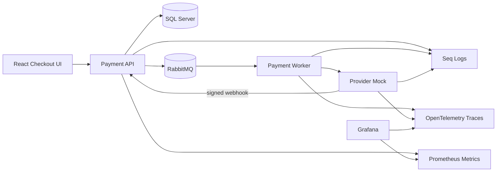
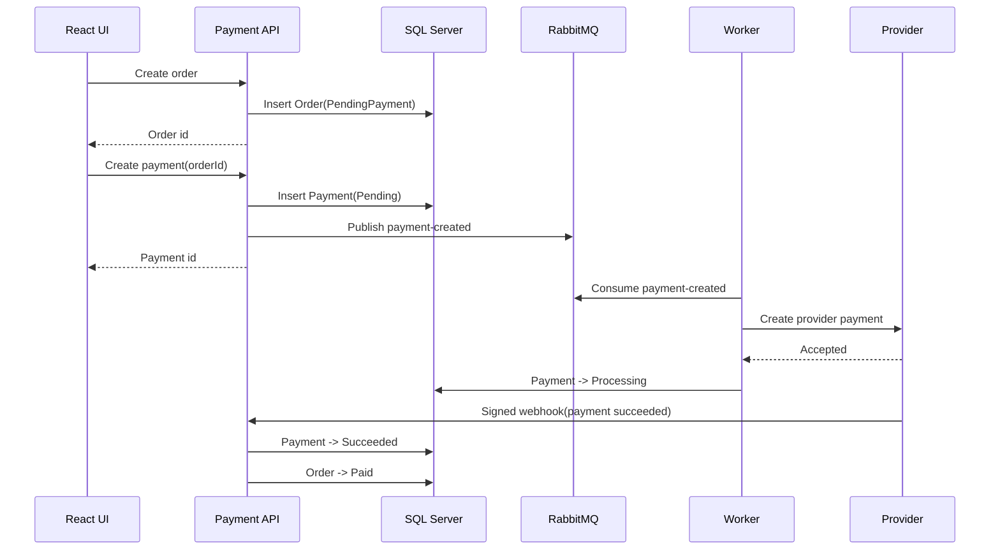
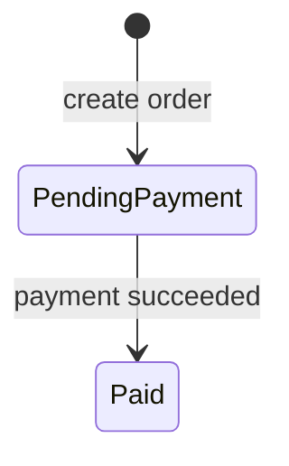
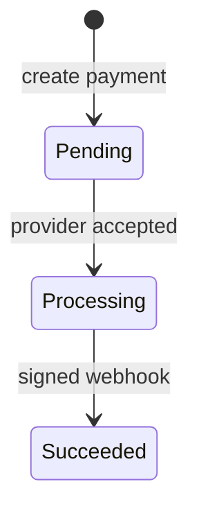

# Payment Reliability

Payment Reliability is a production-style payment workflow focused on reliable checkout, asynchronous provider processing, signed webhooks, retries, dead-letter handling, and operational visibility.

The project models the reliability boundary around payment creation and confirmation: one order creates one payment, provider communication happens through a worker, webhooks are validated and idempotent, and failures are observable.

## Core Capabilities

- Idempotent payment creation: duplicate requests for the same order return the existing payment.
- RabbitMQ-based asynchronous processing with Worker consumers.
- Signed provider webhooks with HMAC validation and timestamp checks.
- Retry and DLQ fallback for provider HTTP 500 and timeout failures.
- Structured logs, correlation IDs, Prometheus metrics, Grafana dashboards, and OpenTelemetry traces.
- Azure-ready service mapping for Azure SQL, Service Bus, Container Apps, and Application Insights.

## Architecture



## Payment Flow



## State Model





## Tech Stack

| Area | Technology |
| --- | --- |
| API | ASP.NET Core Web API, Swagger, ProblemDetails, Health Checks |
| Data | EF Core, SQL Server, migrations, operational indexes |
| Messaging | RabbitMQ, competing consumers, retry, DLQ |
| Worker | .NET Worker Service |
| Frontend | Vite React checkout simulator |
| Observability | Serilog, Seq, Prometheus, Grafana, Tempo, OpenTelemetry |
| Testing | k6 reliability and load scenarios |

## Run Locally

```powershell
docker compose up -d --build
```

Open:

| Tool | URL |
| --- | --- |
| React UI | http://localhost:5173 |
| Swagger | http://localhost:5147/swagger |
| RabbitMQ | http://localhost:15672 |
| Seq | http://localhost:5341 |
| Prometheus | http://localhost:9090 |
| Grafana | http://localhost:3000 |

Expected result for the default checkout flow:

```text
Order = Paid
Payment = Succeeded
```

## Project Structure

```text
ReliablePaymentProcessing.Api             HTTP API, webhooks, Swagger, metrics
ReliablePaymentProcessing.Application     use cases, contracts, service abstractions
ReliablePaymentProcessing.Domain          order/payment entities and state rules
ReliablePaymentProcessing.Infrastructure  EF Core, RabbitMQ, provider client
ReliablePaymentProcessing.Worker          background payment processing
ReliablePaymentProcessing.ProviderMock    fake external provider and webhook sender
ReliablePaymentProcessing.Web             React checkout simulator
docker                                    observability stack
scripts                                   k6 reliability scenarios
```

## Verify

```powershell
dotnet build ReliablePaymentProcessing.slnx
```

Additional documentation:

- [Reliability design](docs/reliability.md)
- [Local development](docs/local-development.md)
- [Observability](docs/observability.md)
- [Azure target architecture](docs/azure-architecture.md)
