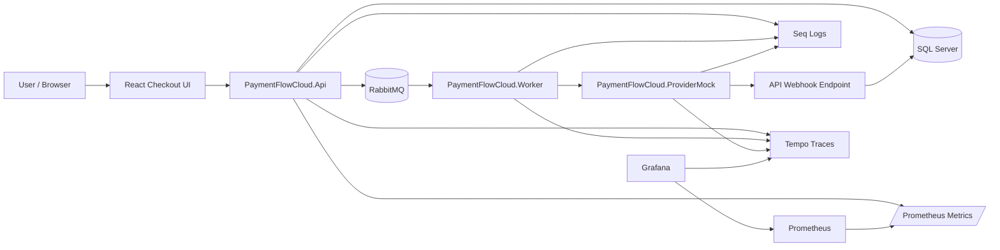
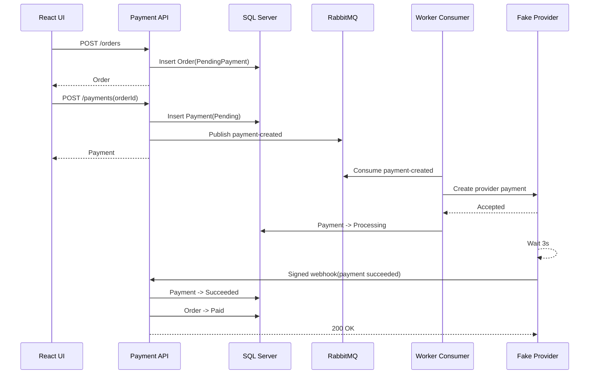
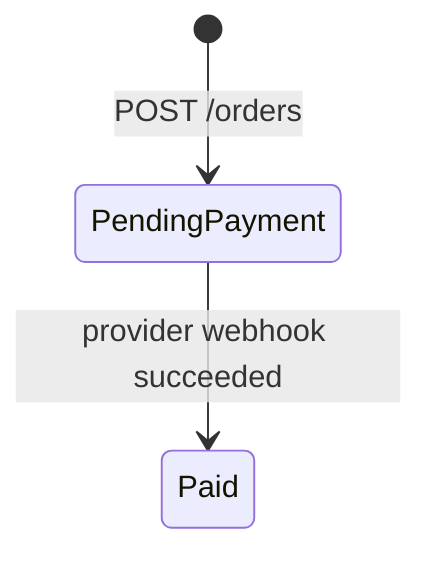
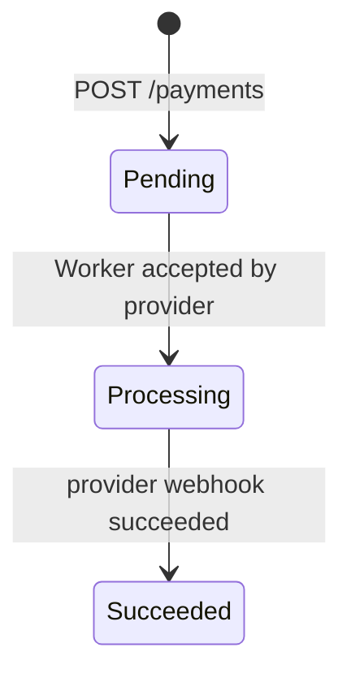

# PaymentFlowCloud

PaymentFlowCloud is a production-style payment processing reference implementation for reliable checkout flows.

It models the reliability boundary around payment creation and confirmation: concurrent payment requests, asynchronous provider processing, signed webhooks, transient failures, dead-letter handling, multi-worker processing, and end-to-end observability.

The flow is intentionally close to a real e-commerce payment system:

```text
Create order -> create payment idempotently -> publish message -> Worker calls provider
-> provider returns Accepted -> provider sends signed webhook -> local payment/order complete
```

## Core Problems Solved

- **Payment idempotency:** one order can create only one payment, even under concurrent requests.
- **Asynchronous processing:** provider communication runs through RabbitMQ and a Worker instead of blocking the API.
- **Reliable failure handling:** provider HTTP 500 and timeout failures go through retry and DLQ fallback.
- **Webhook safety:** provider callbacks are signed with HMAC, timestamp-checked, and handled idempotently.
- **Operational visibility:** logs, correlation IDs, metrics, latency, error ratio, and distributed traces are available locally.
- **Cloud readiness:** the local architecture maps directly to Azure SQL, Azure Service Bus, Container Apps, and Application Insights.

## Tech Stack

| Area | Technology |
| --- | --- |
| API | ASP.NET Core Web API, Swagger, ProblemDetails, Health Checks |
| Application | Clean Architecture-style use cases and service contracts |
| Data | EF Core, SQL Server, migrations, operational indexes |
| Messaging | RabbitMQ, competing consumers, prefetch, retry, DLQ |
| Worker | .NET Worker Service, background consumer, provider client |
| Frontend | Vite React checkout simulation |
| Observability | Serilog, Seq, Prometheus, Grafana, Tempo, OpenTelemetry |
| Load testing | k6 |
| Cloud path | Azure SQL, Azure Service Bus, Container Apps, Application Insights, Azure Monitor |

## Architecture



## Main Payment Flow



## State Model





## Quick Start

Start the full local stack:

```powershell
docker compose up -d --build
```

Open the checkout UI and complete the default flow:

```text
http://localhost:5173
```

The default local flow should end with:

```text
Order = Paid
Payment = Succeeded
```

Useful local endpoints:

| Tool | URL |
| --- | --- |
| React UI | http://localhost:5173 |
| Swagger | http://localhost:5147/swagger |
| RabbitMQ | http://localhost:15672 |
| Seq | http://localhost:5341 |
| Prometheus | http://localhost:9090 |
| Grafana | http://localhost:3000 |
| Tempo | http://localhost:3200 |

Default local credentials:

| Tool | Credentials |
| --- | --- |
| RabbitMQ | `guest / guest` |
| Grafana | `admin / admin` |

Docker Compose normally applies EF Core migrations when the API starts in Development mode. Run migrations manually only when running the API outside Docker or when forcing a schema update:

```powershell
dotnet ef database update --project PaymentFlowCloud.Infrastructure --startup-project PaymentFlowCloud.Api
```

## Documentation

| Document | Contents |
| --- | --- |
| [Local development and test scenarios](docs/local-development.md) | Docker Compose, URLs, k6 scenarios, Worker scaling |
| [Reliability design](docs/reliability.md) | Idempotency, retry, DLQ, webhook security, state transitions |
| [Observability](docs/observability.md) | Metrics, traces, logs, CorrelationId, Azure mapping |
| [Azure target architecture](docs/azure-architecture.md) | Azure service mapping and migration phases |

## Project Structure

```text
PaymentFlowCloud.Api             HTTP API, controllers, middleware, Swagger, metrics
PaymentFlowCloud.Application     Use cases, service interfaces, contracts
PaymentFlowCloud.Domain          Entities, statuses, state transition rules
PaymentFlowCloud.Infrastructure  EF Core, repositories, RabbitMQ, provider client
PaymentFlowCloud.Worker          RabbitMQ consumer and background processing
PaymentFlowCloud.ProviderMock    Fake external payment provider and webhook sender
PaymentFlowCloud.Web             React checkout simulation UI
docker                          Prometheus, Grafana, and Tempo provisioning
scripts                         k6 load and reliability tests
```

## Current Capabilities

| Category | Capabilities |
| --- | --- |
| Idempotency | Unique payment per `OrderId`, duplicate request returns existing payment |
| Messaging | RabbitMQ buffering, Worker prefetch, local concurrency control, multi-worker scaling |
| Failure handling | Fixed-count Worker retry, DLQ fallback, provider timeout and HTTP 500 simulation |
| Webhooks | HMAC signature validation, timestamp tolerance, duplicate webhook safety, provider-side webhook retry |
| Data operations | EF Core migrations, operational indexes on `(Status, CreatedAt)` |
| Observability | Structured logs with `CorrelationId`, API metrics dashboard, OpenTelemetry traces with Tempo |
| Azure readiness | Optional Azure Monitor / Application Insights trace export |

## Roadmap

Near-term priorities:

- Azure SQL deployment path
- Azure Service Bus publisher/consumer implementation
- Container Apps deployment for API, Worker, and ProviderMock
- Optional operational dashboards for queue backlog and payment states

Deferred intentionally:

- Complex delayed retry topology
- DLQ replay tooling
- Redis distributed locking
- Heavy CQRS/MediatR ceremony
- Production payment provider integration
