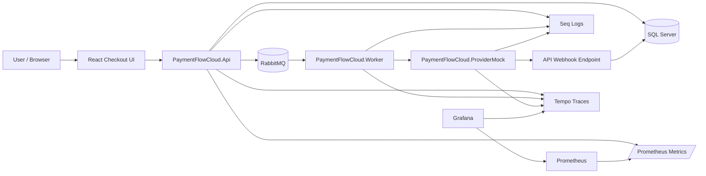
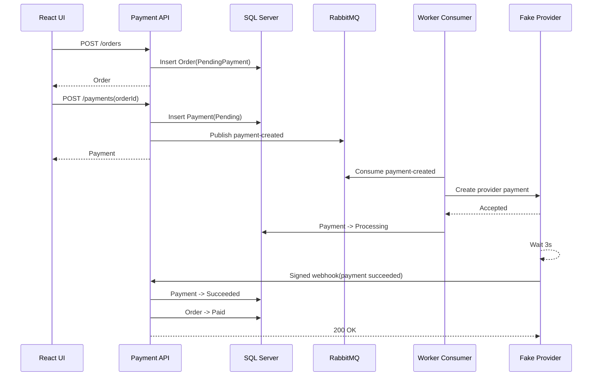
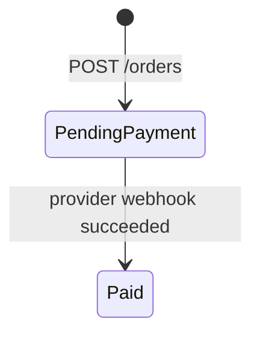
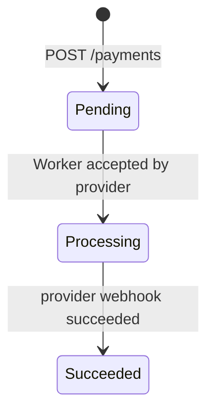
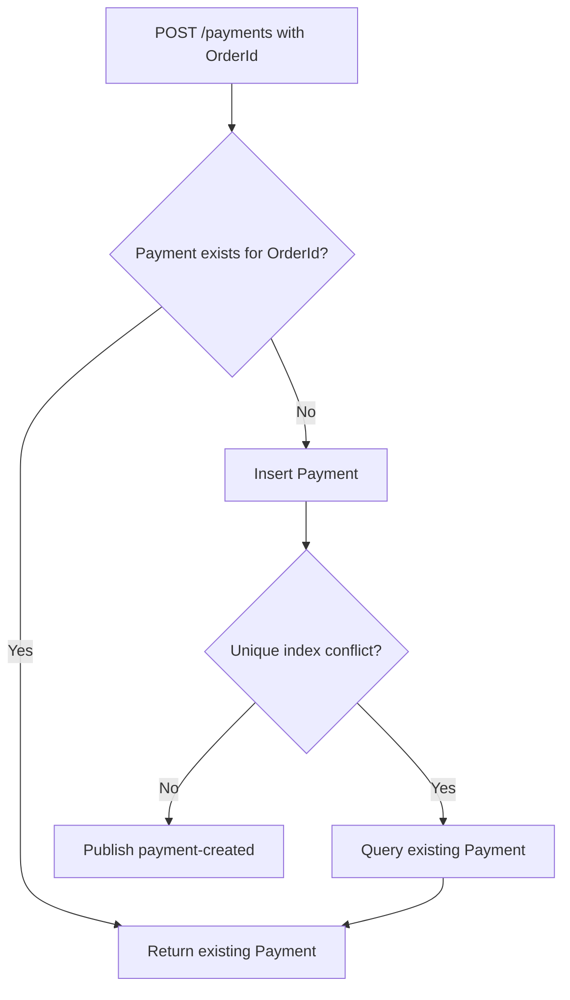
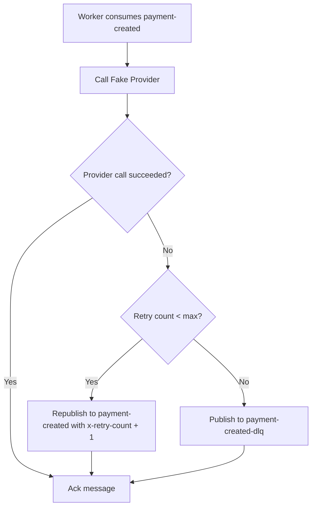
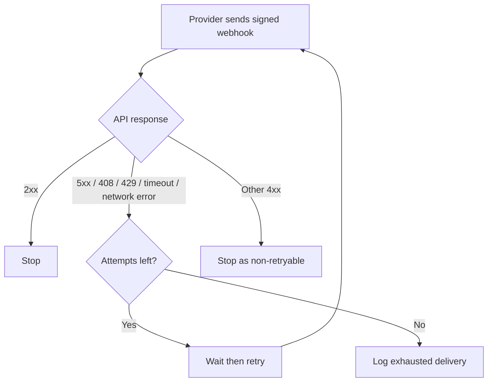

# PaymentFlowCloud

PaymentFlowCloud is a production-style payment processing sample focused on the reliability problems that usually appear around checkout and payment confirmation: duplicate payment requests, asynchronous provider processing, webhook delivery, transient failures, dead-letter handling, and operational visibility.

The system models an e-commerce payment flow where an order is created, a payment is created idempotently, the payment is processed asynchronously through a message broker and worker, a payment provider confirms the result through a signed webhook, and the local order/payment state is updated consistently.

## Problems Addressed

- Prevent duplicate payments for the same order under concurrent requests
- Keep the API fast by moving provider communication to RabbitMQ and a Worker
- Track payment progress through explicit order and payment statuses
- Handle provider HTTP 500 and timeout failures with Worker retry and DLQ fallback
- Validate provider webhooks with HMAC signatures and timestamp tolerance
- Keep webhook handling idempotent when duplicate callbacks arrive
- Retry webhook delivery from the provider side when the API is temporarily unavailable
- Support local multi-worker scaling with RabbitMQ prefetch and concurrency controls
- Expose structured logs, correlation IDs, API metrics, latency, request rate, and 5xx ratio
- Trace the distributed payment flow across API, RabbitMQ, Worker, Provider, and webhook
- Provide reproducible k6 scenarios for idempotency, throughput, webhook duplication, and provider failure

## System Architecture



## Payment Flow



## Status Model





## Reliability Paths

### Payment Idempotency



One `OrderId` can create only one payment. The unique index on `Payments.OrderId` is the final concurrency guard.

### Worker Retry and DLQ



This version intentionally uses immediate fixed-count retry instead of delayed retry queues so the failure flow stays easy to inspect.

### Provider Webhook Retry



Every retry creates a fresh timestamp and HMAC signature.

## Local Stack

Docker Compose starts:

| Service | Purpose |
| --- | --- |
| `api` | ASP.NET Core Payment API, Swagger, metrics, webhook endpoint |
| `worker` | RabbitMQ consumer and provider caller |
| `provider-mock` | Fake external payment provider and webhook sender |
| `web` | React checkout simulation UI |
| `sqlserver` | Local SQL Server |
| `rabbitmq` | RabbitMQ broker and management UI |
| `seq` | Structured log viewer |
| `prometheus` | Metrics scraper |
| `grafana` | Metrics dashboard |
| `tempo` | Distributed trace storage |
| `k6-*` | On-demand load and reliability tests |

## Run Locally

Start everything:

```powershell
docker compose up -d --build
```

Apply database migrations:

```powershell
dotnet ef database update --project PaymentFlowCloud.Infrastructure --startup-project PaymentFlowCloud.Api
```

Useful URLs:

| Tool | URL |
| --- | --- |
| React UI | http://localhost:5173 |
| Swagger | http://localhost:5147/swagger |
| RabbitMQ | http://localhost:15672 |
| Seq | http://localhost:5341 |
| Prometheus | http://localhost:9090 |
| Grafana | http://localhost:3000 |
| Tempo | http://localhost:3200 |
| ProviderMock | http://localhost:5290/provider/payments |

Default local credentials:

| Tool | Credentials |
| --- | --- |
| RabbitMQ | `guest / guest` |
| Grafana | `admin / admin` |

## Demo Scenarios

### 1. Normal Checkout Flow

Open the React UI and use the checkout flow:

```text
http://localhost:5173
```

Expected result:

```text
Order = Paid
Payment = Succeeded
```

### 2. Same Order, Concurrent Payment Requests

This sends concurrent `POST /payments` requests for the same order.

```powershell
docker compose run --rm --no-deps -e VUS=20 -e ITERATIONS=20 -e FINAL_STATUS_TIMEOUT_SECONDS=15 k6
```

Expected result:

```text
Only one payment is created for the order.
Payment eventually becomes Succeeded.
Order eventually becomes Paid.
```

### 3. API Throughput Baseline

This measures the synchronous API boundary:

```text
POST /orders
POST /payments
GET /payments/{id}
```

Run:

```powershell
docker compose run --rm --no-deps -e VUS=20 -e ITERATIONS=100 k6-api-throughput
```

Use this to observe request rate, latency, SQL insert cost, and RabbitMQ publish overhead.

### 4. Full Async Payment Throughput

This creates different orders and payments, then waits for the provider/webhook flow.

```powershell
docker compose run --rm --no-deps -e VUS=10 -e ITERATIONS=20 -e FINAL_STATUS_TIMEOUT_SECONDS=20 k6-throughput
```

Expected result:

```text
Payment = Succeeded
Order = Paid
```

### 5. Duplicate Webhook Idempotency

This posts the same successful provider webhook multiple times.

```powershell
docker compose run --rm --no-deps -e DUPLICATE_WEBHOOK_COUNT=3 -e FINAL_STATUS_TIMEOUT_SECONDS=20 k6-webhook-duplicate
```

Expected result:

```text
Payment remains Succeeded.
Order remains Paid.
```

### 6. Provider Failure and DLQ

HTTP 500 failure:

```powershell
$env:PROVIDER_MOCK_MODE="Http500"
docker compose up -d --build provider-mock worker
docker compose run --rm --no-deps -e DLQ_TIMEOUT_SECONDS=20 k6-provider-failure
```

Timeout failure:

```powershell
$env:PROVIDER_MOCK_MODE="Timeout"
docker compose up -d --build provider-mock worker
docker compose run --rm --no-deps -e DLQ_TIMEOUT_SECONDS=30 k6-provider-failure
```

Restore success mode:

```powershell
$env:PROVIDER_MOCK_MODE="Success"
docker compose up -d --build provider-mock worker
```

Expected failure result:

```text
Payment remains Pending.
Order remains PendingPayment.
payment-created message reaches payment-created-dlq.
```

### 7. Worker Scaling

Run multiple Worker instances:

```powershell
docker compose up -d --build --scale worker=5
```

Current Worker tuning options:

| Option | Meaning |
| --- | --- |
| `RabbitMQ__PrefetchCount` | How many unacknowledged messages RabbitMQ can deliver to one Worker instance |
| `RabbitMQ__MaxConcurrentMessages` | How many messages one Worker process handles at the same time |

With `worker=5` and `MaxConcurrentMessages=5`, the local stack can process up to about 25 messages concurrently.

## Observability

### Metrics

The API exposes Prometheus metrics:

```text
http://localhost:5147/metrics
```

Prometheus scrapes the API every 5 seconds:

```text
http://localhost:9090
```

Grafana is preconfigured with a Prometheus datasource and a `PaymentFlowCloud API` dashboard:

```text
http://localhost:3000
```

The dashboard focuses on:

- API request rate
- API p95 / p99 latency
- API 5xx error ratio
- API responses by status code

Run k6 while Grafana is open to see metrics move:

```powershell
docker compose run --rm --no-deps -e VUS=100 -e ITERATIONS=3000 k6-api-throughput
```

### Traces

OpenTelemetry sends distributed traces to Tempo:

```text
API / Worker / ProviderMock -> OTLP -> Tempo -> Grafana
```

When `APPLICATIONINSIGHTS_CONNECTION_STRING` is configured, the same trace spans are also exported to Azure Monitor / Application Insights:

```powershell
$env:APPLICATIONINSIGHTS_CONNECTION_STRING="<your-application-insights-connection-string>"
docker compose up -d --build api worker provider-mock
```

Tempo is provisioned as a Grafana datasource:

```text
http://localhost:3000
```

Use Grafana `Explore`, select the `Tempo` datasource, then search by trace attributes such as:

```text
correlation.id = "CORR-123"
payment.id = "..."
order.id = "..."
```

The main payment trace shows:

```text
POST /payments
-> rabbitmq publish payment-created
-> rabbitmq consume payment-created
-> Worker HTTP call to ProviderMock
-> Provider webhook delivery delay
-> API webhook callback
-> payment/order completion
```

### Logs

The local stack sends structured logs to Seq:

```text
http://localhost:5341
```

The API accepts an optional correlation header:

```http
X-Correlation-Id: CORR-123
```

If missing, the API generates one and returns it in the response header. The same `CorrelationId` is stored on the payment, published in the RabbitMQ message, and used by the Worker and Provider logs.

Useful Seq queries:

```text
CorrelationId = 'CORR-123'
PaymentId = '...'
OrderId = '...'
```

## RabbitMQ

Local queues:

```text
payment-created
payment-created-dlq
```

Message retry is currently simple and immediate:

```text
Worker consumes payment-created
-> success: ack
-> failure and x-retry-count < 3: republish to payment-created with x-retry-count + 1, then ack original message
-> failure and x-retry-count >= 3: publish to payment-created-dlq, then ack original message
```

## Project Structure

```text
PaymentFlowCloud.Api             HTTP API, controllers, middleware, Swagger, metrics
PaymentFlowCloud.Application     Use cases, service interfaces, contracts
PaymentFlowCloud.Domain          Entities, statuses, state transition rules
PaymentFlowCloud.Infrastructure  EF Core, repositories, RabbitMQ, provider client
PaymentFlowCloud.Worker          RabbitMQ consumer and background processing
PaymentFlowCloud.ProviderMock    Fake external payment provider and webhook sender
PaymentFlowCloud.Web             React checkout simulation UI
docker                          Prometheus, Grafana, and Tempo provisioning
scripts                         k6 load and reliability tests
```

## Current Reliability Features

- Database unique constraint for payment idempotency
- RabbitMQ queue buffering
- Worker prefetch and local concurrency control
- Multi-worker scaling
- Fixed-count Worker retry
- DLQ fallback
- Duplicate webhook safety
- HMAC webhook signature validation
- Provider webhook delivery retry
- Provider timeout and HTTP 500 simulation
- Operational indexes on `(Status, CreatedAt)` for order/payment scans
- Structured logs with `CorrelationId`
- API metrics dashboard
- Distributed tracing with OpenTelemetry and Tempo
- Optional Azure Monitor / Application Insights trace export

## Roadmap

Near-term priorities:

- Azure target architecture: [docs/azure-architecture.md](docs/azure-architecture.md)
- Azure migration path with Container Apps and queue-based processing
- Optional operational dashboards for queue backlog and payment states

Deferred intentionally:

- Complex delayed retry topology
- DLQ replay tooling
- Redis distributed locking
- Heavy CQRS/MediatR ceremony
- Production payment provider integration
