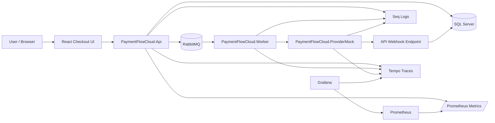
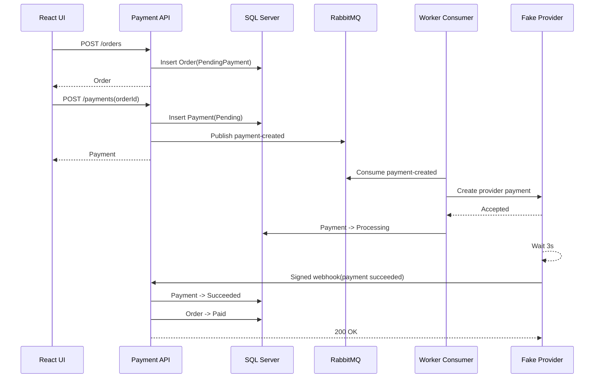
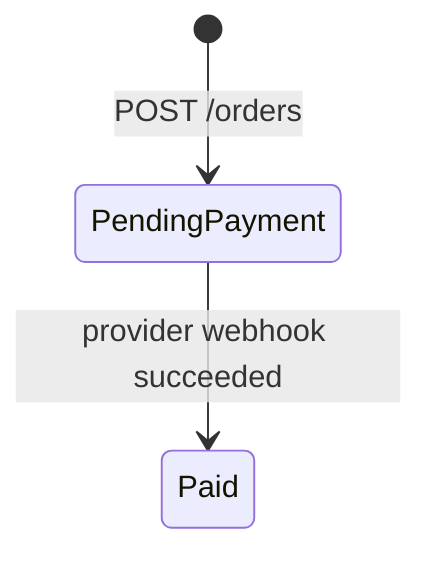
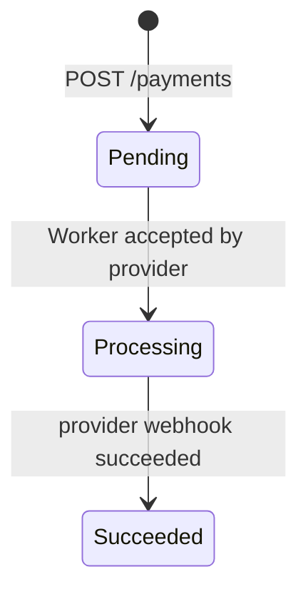

# PaymentFlowCloud

PaymentFlowCloud is a production-style payment processing reference implementation for reliable checkout flows. It focuses on the failure modes that matter in payment systems: duplicate payment requests, asynchronous provider processing, webhook confirmation, transient failures, dead-letter handling, observability, and cloud migration readiness.

The system models an e-commerce flow where an order is created, a payment is created idempotently, provider processing runs asynchronously through a message broker and Worker, the provider confirms the final result through a signed webhook, and local order/payment state is updated consistently.

## Core Problems Solved

- Prevent duplicate payments for the same order under concurrent requests
- Keep the API responsive by moving provider communication to RabbitMQ and a Worker
- Track payment progress through explicit order and payment status transitions
- Handle provider HTTP 500 and timeout failures with retry and DLQ fallback
- Validate provider webhooks with HMAC signatures and timestamp tolerance
- Keep webhook processing idempotent when duplicate callbacks arrive
- Support local multi-worker scaling with RabbitMQ prefetch and concurrency controls
- Expose structured logs, correlation IDs, API metrics, request latency, error ratio, and distributed traces
- Provide reproducible k6 scenarios for idempotency, throughput, webhook duplication, and provider failures

## Architecture



## Payment Flow



## Status Model





## Quick Start

Start the full local stack:

```powershell
docker compose up -d --build
```

Open the checkout UI:

```text
http://localhost:5173
```

The default local flow should end with:

```text
Order = Paid
Payment = Succeeded
```

Useful local URLs:

| Tool | URL |
| --- | --- |
| React UI | http://localhost:5173 |
| Swagger | http://localhost:5147/swagger |
| RabbitMQ | http://localhost:15672 |
| Seq | http://localhost:5341 |
| Prometheus | http://localhost:9090 |
| Grafana | http://localhost:3000 |
| Tempo | http://localhost:3200 |

Default local credentials:

| Tool | Credentials |
| --- | --- |
| RabbitMQ | `guest / guest` |
| Grafana | `admin / admin` |

Docker Compose normally applies EF Core migrations when the API starts in Development mode. Run migrations manually only when running the API outside Docker or when forcing a schema update:

```powershell
dotnet ef database update --project PaymentFlowCloud.Infrastructure --startup-project PaymentFlowCloud.Api
```

## Documentation

- [Local development and test scenarios](docs/local-development.md)
- [Reliability design](docs/reliability.md)
- [Observability](docs/observability.md)
- [Azure target architecture](docs/azure-architecture.md)

## Project Structure

```text
PaymentFlowCloud.Api             HTTP API, controllers, middleware, Swagger, metrics
PaymentFlowCloud.Application     Use cases, service interfaces, contracts
PaymentFlowCloud.Domain          Entities, statuses, state transition rules
PaymentFlowCloud.Infrastructure  EF Core, repositories, RabbitMQ, provider client
PaymentFlowCloud.Worker          RabbitMQ consumer and background processing
PaymentFlowCloud.ProviderMock    Fake external payment provider and webhook sender
PaymentFlowCloud.Web             React checkout simulation UI
docker                          Prometheus, Grafana, and Tempo provisioning
scripts                         k6 load and reliability tests
```

## Current Capabilities

- Database unique constraint for payment idempotency
- RabbitMQ queue buffering
- Worker prefetch and local concurrency control
- Multi-worker scaling
- Fixed-count Worker retry
- DLQ fallback
- Duplicate webhook safety
- HMAC webhook signature validation
- Provider webhook delivery retry
- Provider timeout and HTTP 500 simulation
- Operational indexes on `(Status, CreatedAt)` for order/payment scans
- Structured logs with `CorrelationId`
- API metrics dashboard
- Distributed tracing with OpenTelemetry and Tempo
- Optional Azure Monitor / Application Insights trace export

## Roadmap

Near-term priorities:

- Azure migration path with Container Apps and queue-based processing
- Azure SQL deployment path
- Azure Service Bus publisher/consumer implementation
- Optional operational dashboards for queue backlog and payment states

Deferred intentionally:

- Complex delayed retry topology
- DLQ replay tooling
- Redis distributed locking
- Heavy CQRS/MediatR ceremony
- Production payment provider integration
