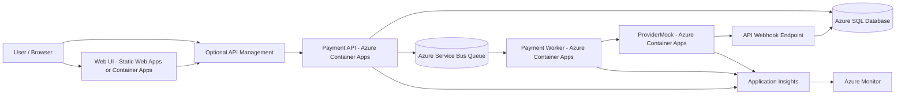
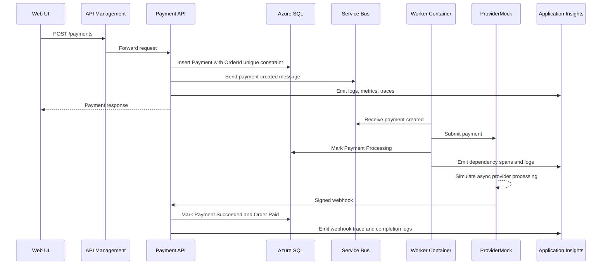

# Azure Target Architecture

This document defines the planned Azure migration path for PaymentFlowCloud. The goal is to keep the current payment business flow intact while replacing the local infrastructure with managed Azure services.

## Target Goals

- Keep the same payment flow: order creation, idempotent payment creation, async processing, provider callback, and final status update.
- Replace local infrastructure with managed Azure services where it improves reliability and operations.
- Preserve observability across API, queue, Worker, ProviderMock, and webhook callbacks.
- Keep the first cloud version simple enough to deploy and reason about.
- Avoid changing the domain model just to fit Azure services.

## Local to Azure Mapping

| Local Component | Azure Target | Reason |
| --- | --- | --- |
| `PaymentFlowCloud.Api` container | Azure Container Apps API | Fits the existing containerized ASP.NET Core API and supports managed ingress and scaling |
| `PaymentFlowCloud.Worker` container | Azure Container Apps Worker | Keeps the current long-running Worker model and supports queue-based scaling |
| `PaymentFlowCloud.ProviderMock` container | Azure Container Apps internal service | Keeps the fake provider available for cloud demos and end-to-end tests |
| `PaymentFlowCloud.Web` container | Azure Static Web Apps or Container Apps | Static Web Apps is cleaner for frontend hosting; Container Apps is simpler if reusing the current nginx container |
| SQL Server container | Azure SQL Database | Managed relational persistence for orders, payments, idempotency, and operational queries |
| RabbitMQ | Azure Service Bus Queue | Managed business messaging with DLQ, message metadata, retries, and operational tooling |
| RabbitMQ DLQ | Azure Service Bus built-in DLQ | Native dead-letter support per queue |
| Seq | Application Insights / Log Analytics | Centralized cloud logs and queries |
| Prometheus + Grafana | Azure Monitor / Application Insights metrics | Managed cloud metrics for API and dependency health |
| Tempo | Application Insights distributed tracing | Managed trace storage and waterfall views from OpenTelemetry |
| k6 scripts | Local k6 first, optional Azure Load Testing later | Local scripts remain useful; Azure Load Testing can be added later for cloud baseline tests |

## Proposed Architecture



## Cloud Payment Flow



## Recommended First Cloud Version

The first cloud deployment should stay close to the current local design:

```text
Azure SQL
Azure Service Bus Queue
Azure Container Apps: API
Azure Container Apps: Worker
Azure Container Apps: ProviderMock
Application Insights / Azure Monitor
```

Optional for the first version:

```text
API Management
Static Web Apps
Azure Load Testing
```

Not recommended for the first version:

```text
Outbox pattern
Complex delayed retry queues
Multi-region deployment
Production payment provider integration
```

## Queue Choice

### Primary Choice: Azure Service Bus

Azure Service Bus is the preferred cloud queue for this project because the payment flow uses business messages and needs reliable processing semantics.

Service Bus gives:

- Built-in DLQ
- Message metadata and headers
- Dead-letter reason and description
- Scheduled messages if delayed retry is added later
- Duplicate detection if needed later
- Better fit for business workflows than a basic storage queue

### Alternative: Azure Queue Storage

Azure Queue Storage is cheaper and simpler, but it is less expressive for this project.

It can be useful for:

- Simple background tasks
- Low-cost async workloads
- Non-critical processing

For the main payment-created flow, Service Bus is a better match.

## Worker Hosting Choice

### Primary Choice: Container Apps Worker

The current `PaymentFlowCloud.Worker` is already a long-running .NET Worker service. Azure Container Apps can host it with minimal code changes.

Benefits:

- Reuses the current Worker structure
- Supports horizontal scaling
- Can scale based on Service Bus queue length
- Works well with OpenTelemetry and Application Insights
- Keeps the local Worker and cloud Worker mental model aligned

### Alternative: Azure Functions

Azure Functions can also process Service Bus messages through a Service Bus trigger.

Good use cases:

- Queue-triggered payment consumer
- Timer-triggered reconciliation job
- Small operational tasks

Recommended project usage:

```text
Main payment consumer: Container Apps Worker first
Future reconciliation job: Azure Functions Timer Trigger
Alternative consumer demo: Azure Functions Service Bus Trigger
```

## API Management Position

API Management should sit in front of the Payment API when the project needs a production-style API edge.

APIM can handle:

- External API endpoint
- Rate limiting
- Subscription keys
- JWT validation
- Request and response policies
- OpenAPI import
- API versioning
- Header normalization such as `X-Correlation-Id`

Recommended order:

```text
Deploy API directly first
Add APIM after the API and Service Bus flow works in Azure
```

## Observability Mapping

| Local | Azure |
| --- | --- |
| Seq structured logs | Application Insights logs / Log Analytics |
| Prometheus metrics | Application Insights metrics / Azure Monitor metrics |
| Grafana dashboard | Azure Monitor Workbooks / Application Insights dashboards |
| Tempo traces | Application Insights distributed tracing |
| `CorrelationId` log scope | Application Insights custom property |
| OpenTelemetry trace spans | Application Insights dependencies and request traces |

The current OpenTelemetry setup should be preserved. Locally it exports to Tempo; in Azure it should export to Azure Monitor / Application Insights.

## Migration Phases

### Phase 1: Cloud Architecture and Configuration

- Document local-to-Azure mapping.
- Define required Azure services.
- Decide which services are mandatory for the first deployment.
- Keep local Docker Compose unchanged as the reference environment.

### Phase 2: Application Insights

- Add Azure Monitor OpenTelemetry exporter.
- Configure Application Insights connection string through environment variables.
- Keep local Tempo exporter for Docker Compose.
- Verify traces for `POST /payments`, Worker processing, ProviderMock call, and webhook callback.

### Phase 3: Azure SQL

- Create Azure SQL Database.
- Apply EF Core migrations.
- Move connection string to environment configuration or managed secret.
- Verify order/payment creation and idempotency against Azure SQL.

### Phase 4: Azure Service Bus

- Add Service Bus publisher implementation.
- Add Service Bus consumer implementation or adapter.
- Preserve message metadata:
  - `CorrelationId`
  - `PaymentId`
  - W3C `traceparent`
  - W3C `tracestate`
- Map retry and DLQ behavior to Service Bus completion, abandon, and dead-letter operations.

### Phase 5: Container Apps Deployment

- Build and push container images.
- Deploy API, Worker, ProviderMock, and optionally Web.
- Configure environment variables.
- Configure Service Bus queue-based scaling for Worker.
- Verify health checks, logs, traces, and payment completion.

### Phase 6: Optional Edge and Serverless Enhancements

- Add API Management in front of the Payment API.
- Add Azure Functions Timer Trigger for reconciliation.
- Add Azure Load Testing for cloud throughput baseline.

## What Should Stay the Same

- Domain entities and status rules.
- Payment idempotency based on `OrderId`.
- Controller-based API shape.
- Application service boundaries.
- CorrelationId propagation.
- OpenTelemetry instrumentation model.
- k6 scripts as local and cloud verification tools.

## What Will Change

- RabbitMQ client code will need an Azure Service Bus equivalent.
- RabbitMQ retry/DLQ behavior will map to Service Bus settlement operations.
- Local observability endpoints will map to Azure Monitor and Application Insights.
- Docker Compose environment variables will map to Container Apps configuration and secrets.
- Local SQL Server connection strings will map to Azure SQL.

## Future Enhancements

- Reconciliation job for stuck `Processing` payments.
- Optional Service Bus delayed retry topology.
- Optional outbox pattern if the DB-write / message-publish gap becomes part of the reliability scope.
- APIM policies for rate limiting and authentication.
- Azure Monitor alerts for:
  - API 5xx ratio
  - high p95 latency
  - queue backlog
  - DLQ message count
  - stuck `Processing` payments
