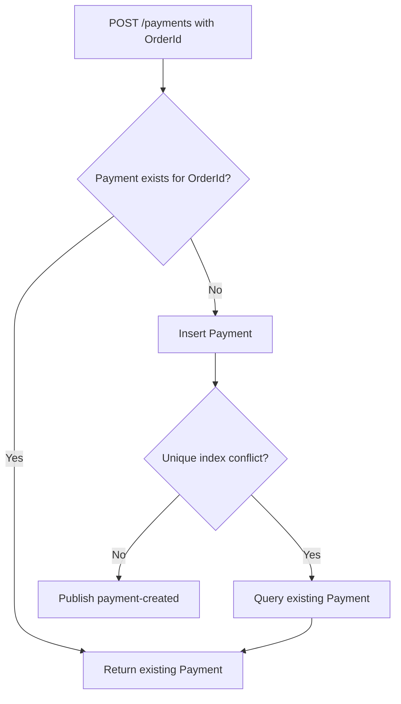
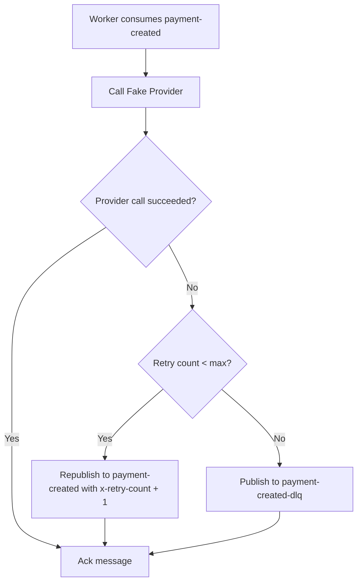
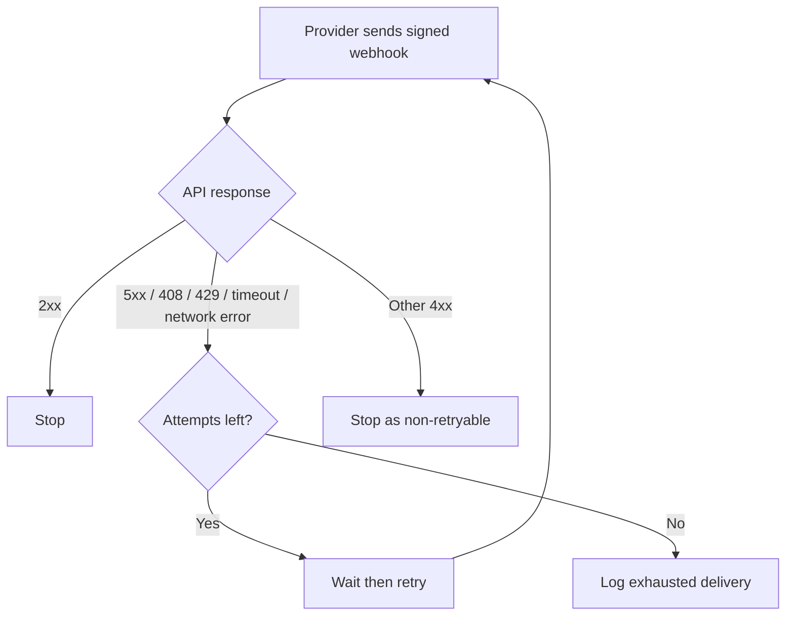
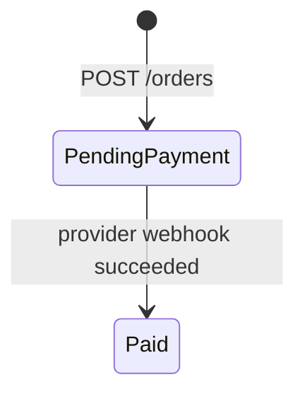
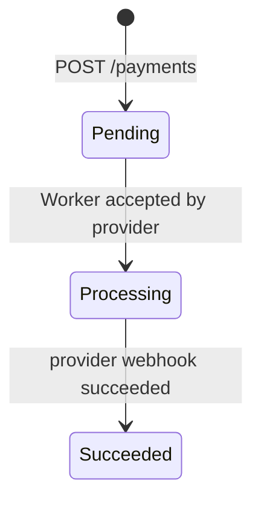

# Reliability Design

This document describes the reliability mechanisms used in the payment flow.

## Payment Idempotency



One `OrderId` can create only one payment. The unique index on `Payments.OrderId` is the final concurrency guard.

The application checks first for an existing payment and returns it when found. If concurrent requests still race, the database unique index guarantees that only one insert succeeds. The losing request reloads the existing payment and returns the same business result.

## Worker Retry and DLQ



This version intentionally uses immediate fixed-count retry instead of delayed retry queues so the failure flow stays easy to inspect.

Local queues:

```text
payment-created
payment-created-dlq
```

Message retry behavior:

```text
Worker consumes payment-created
-> success: ack
-> failure and x-retry-count < 3: republish to payment-created with x-retry-count + 1, then ack original message
-> failure and x-retry-count >= 3: publish to payment-created-dlq, then ack original message
```

## Provider Webhook Retry



Every retry creates a fresh timestamp and HMAC signature.

The retry belongs to the provider side because the provider is the caller of the webhook endpoint. The API endpoint remains idempotent, so duplicate provider callbacks are safe.

## Webhook Security

Provider webhooks are protected with:

- HMAC signature validation
- Timestamp tolerance
- Correlation ID propagation
- Idempotent state updates

The timestamp limits replay attacks. The HMAC proves that the payload was signed with the shared webhook secret and was not modified in transit.

## State Transitions

Order status:



Payment status:



Status updates go through explicit domain rules instead of uncontrolled string assignment.

## Current Tradeoffs

Implemented now:

- Payment idempotency by `OrderId`
- Immediate Worker retry
- DLQ fallback
- Provider webhook retry
- Duplicate webhook safety
- HMAC webhook validation
- Provider failure simulation
- Worker prefetch and local concurrency control
- Multi-worker scaling

Deferred intentionally:

- Delayed retry queues
- DLQ replay tooling
- Outbox pattern
- Inbox table for webhook events
- Redis distributed locking
- Production provider adapter

The deferred items are useful in stricter production environments, but they would add complexity before the current local and Azure migration path needs them.
